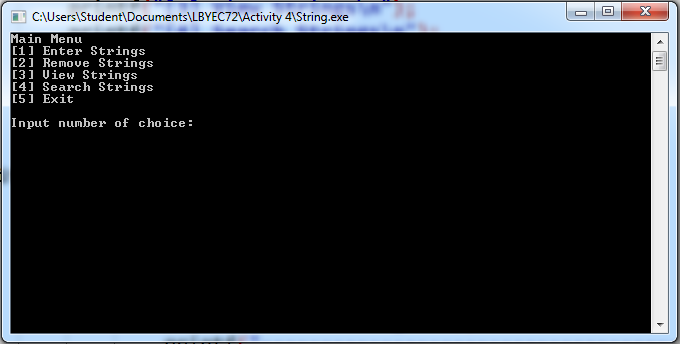
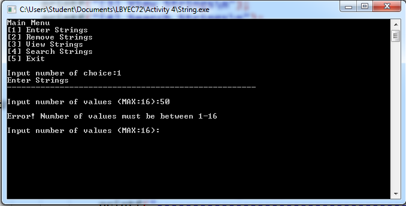
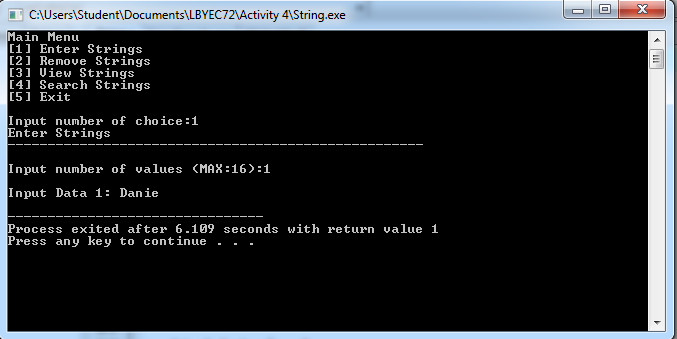
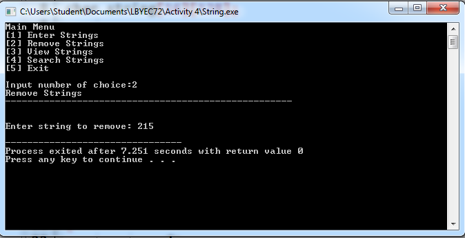
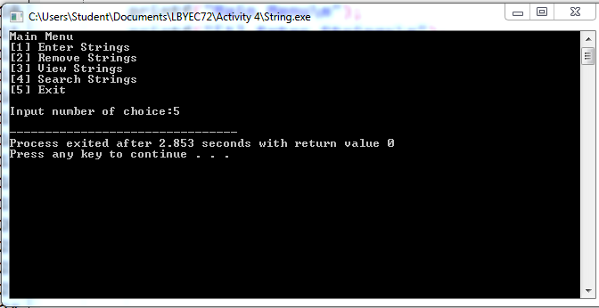
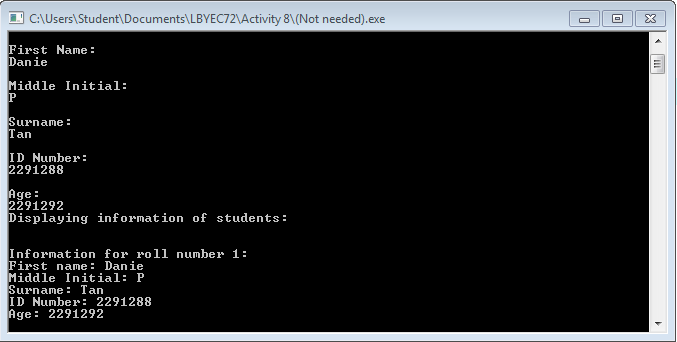

# lbyec72-ej1-p5-strings-daniellegailtan
lbyec72-ej1-p5-strings-daniellegailtan created by GitHub Classroom

Created: Main Menu and Enter String and Remove String Submenu

Problem: The values entered does not store. 

Successful: Main Menu

-----UPDATE-----

I separate the view and add first, combining it to check if it works because removing and searching still not working.
